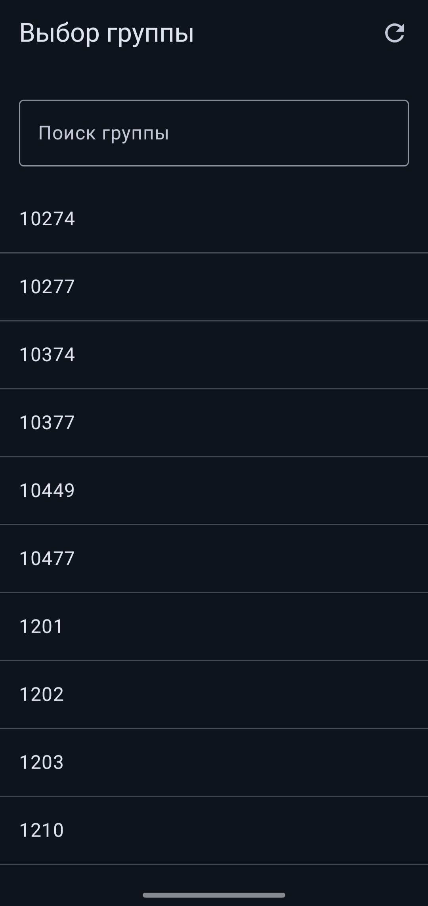
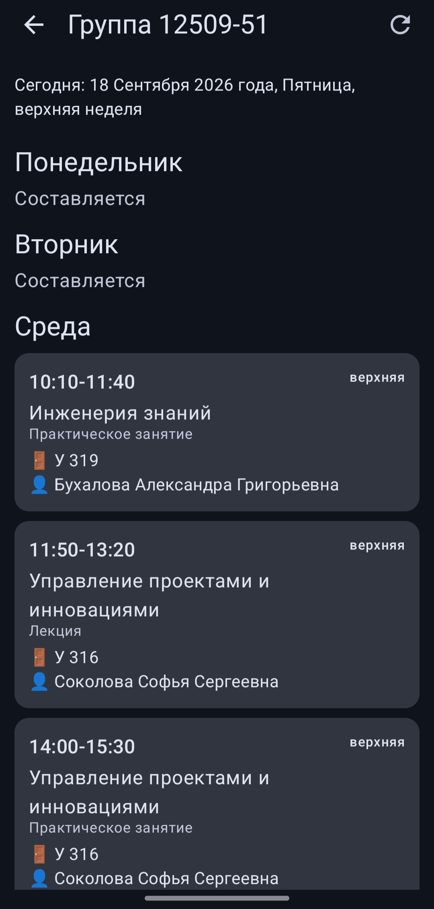

# СПбГМТУ Расписание

Приложение для просмотра расписания занятий СПбГМТУ.
## Что умеет

- Выбор группы из списка всех факультетов
- Расписание на текущую неделю
- Расписание открывается мгновенно при повторном запуске
- Обновление одной кнопкой

## Скриншоты

  
  

## Установка
Скачай `app-release.apk` из раздела **Releases**.

## Требования

Android 7.0 и выше.
